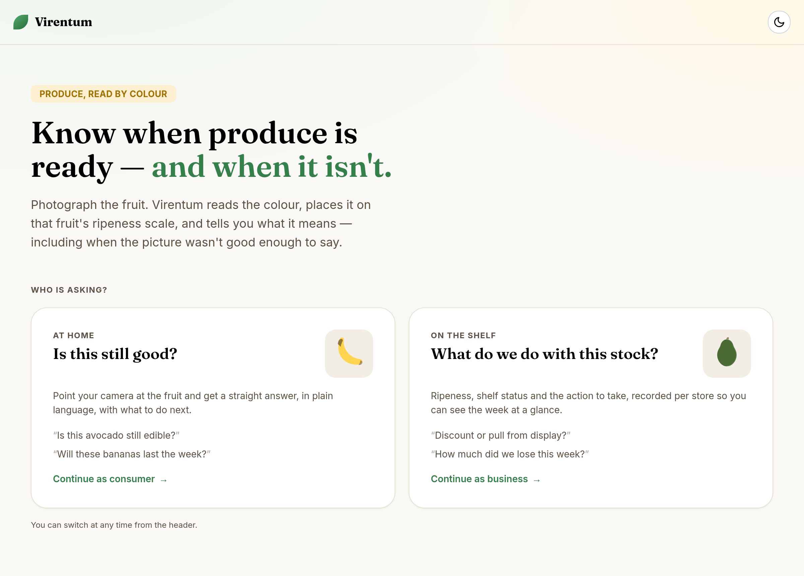
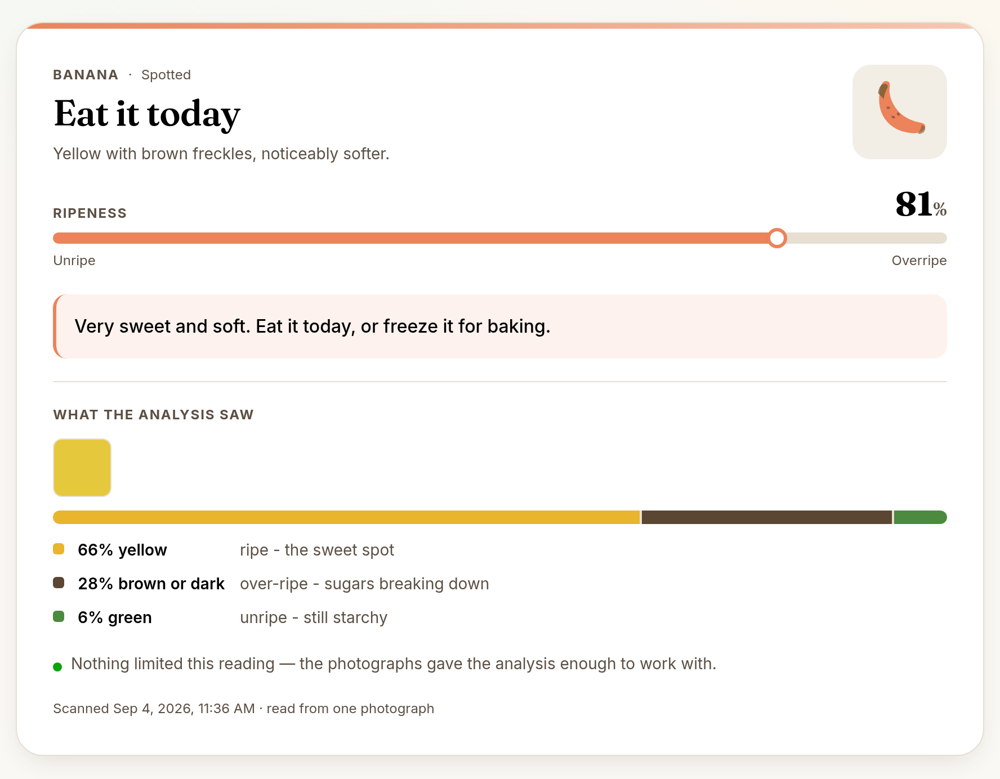
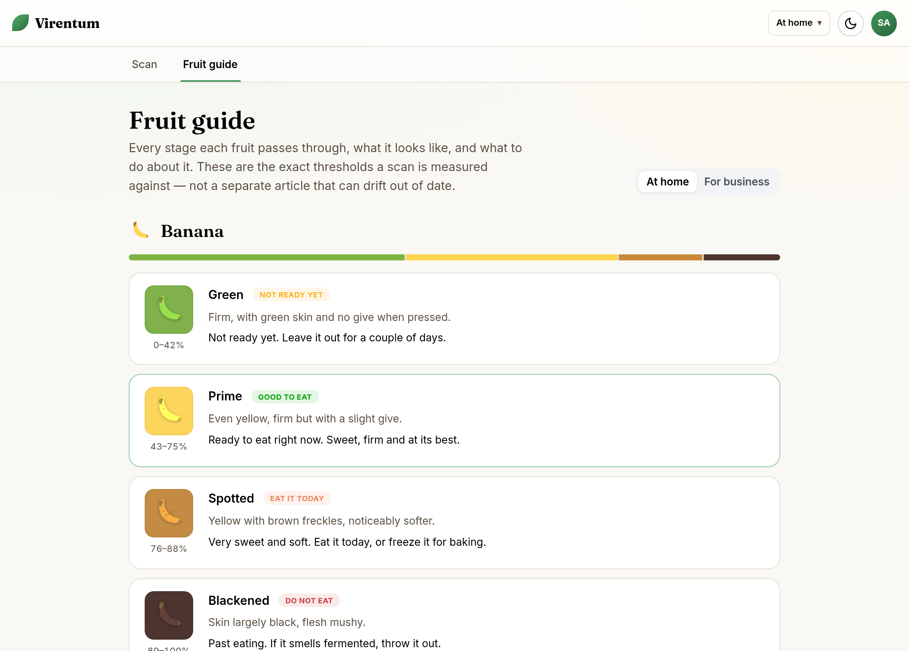

# Virentum

[](https://github.com/NahomHadgebes/Virentum/actions/workflows/ci.yml)

Photograph a piece of fruit and Virentum tells you where it sits on that
fruit's ripeness scale, what that means, and what to do about it — for a
shopper deciding whether to eat something, or a shop deciding whether to
discount it.

An ASP.NET Core 8 API and a React 19 single-page app, in one repository.



## The idea

Ripeness is a colour problem before it is anything else, and the two people
looking at the same banana are asking different questions. A shopper wants to
know whether to eat it. A shop wants to know whether to discount it. Virentum
measures once and words the answer twice.

| | At home | On the shelf |
|---|---|---|
| The question | Can I still eat this? | What do we do with this stock? |
| The verdict | `NotReadyYet · Good · EatSoon · DoNotEat` | `Underripe · ReadyForSale · ActionRequired · Expired` |
| The advice | "Very sweet and soft. Eat it today, or freeze it for baking." | "This batch is 81% ripe. Print a 50% discount label immediately." |



## What it will not pretend to know

The colour stage is a heuristic: it counts green, yellow and brown/dark pixels
and places the mix on a per-fruit scale. That is a real measurement of a real
thing, and it is not the same as knowing whether a fruit is good.

So the API reports what the reading rested on, and the UI shows it:

- **Every scan carries its factors** — the share of each colour and what that
  colour means *for that fruit*, so the number can be checked rather than
  believed.
- **A thin reading says so.** If less than 20% of the frame held produce-like
  colour, or if the image is dominated by a colour the selected fruit never
  takes, the response says which and the card leads with it instead of the
  verdict.
- **A mango's red blush is not read at all.** Blush is sun exposure, not
  ripeness, and it falls outside the hues the colour stage classifies — so a
  heavily blushed mango comes back as a thin reading rather than a confident
  wrong one.

There are no mocked responses and no fallbacks anywhere in the frontend. If the
API fails, the RFC 7807 problem details are on screen with the trace id.

## The fruit guide

Every stage of every fruit, drawn from the same bands a scan is judged against —
so the guide cannot drift away from the thresholds it documents.



## Running it locally

**Prerequisites:** .NET 8 SDK, Node 22, and PostgreSQL. Development runs against
a real Postgres rather than an in-memory provider, so the enum-to-string
conversions and the history queries behave exactly as they do in production.

```bash
createdb virentum_dev     # credentials in backend/src/Virentum.Api/appsettings.Development.json
```

**First time only** — the schema is applied by EF Core migrations at startup,
and the repository does not carry one yet:

```bash
cd backend
dotnet tool install --global dotnet-ef        # if you do not have it
dotnet ef migrations add InitialCreate --project src/Virentum.Api
```

**The API:**

```bash
cd backend
dotnet run --project src/Virentum.Api
# http://localhost:5000 · Swagger UI at /swagger
```

It seeds one development operator on first run: store id `demo-store`, password
`changeit`. Nothing is seeded outside Development.

**The frontend:**

```bash
cd frontend
cp .env.example .env      # VITE_API_BASE_URL=http://localhost:5000
npm install
npm run dev               # http://localhost:5173
```

There is no default base URL: the app throws at startup if `VITE_API_BASE_URL`
is missing, rather than guessing a host and failing later with a confusing CORS
error.

> The API does not hot-reload. If you pull a change that adds a fruit, restart
> `dotnet run` — the frontend only offers the fruits the running API reports, so
> a short list in the selector means a stale API process.

## Tests

```bash
cd backend  && dotnet test        # xUnit — processors, bands, evidence, services, error handling
cd frontend && npm run test       # Vitest + Testing Library
cd frontend && npm run lint && npm run typecheck
```

The backend suite uses hand-written doubles for the repository, the clock and
the vision provider, so it needs no database and no Azure account.

## The API

Every endpoint except login requires `Authorization: Bearer <jwt>`. Errors are
RFC 7807 problem details with a `traceId`, produced by a single
`IExceptionHandler`.

| Endpoint | Purpose |
|---|---|
| `POST /api/auth/login` | `{ storeId, password }` → `{ token, user }` |
| `GET /api/fruits` | Every fruit this build can inspect, with its full band table. The frontend's selector and guide are both built from this. |
| `POST /api/inspection/scan` | multipart: `Images` (1–3), `FruitType`, `Audience` → the verdict, its factors and its evidence |
| `GET /api/inspection/history` | The store's recent inspections |
| `GET /api/inspection/summary` | Counts by status and by fruit over a rolling window |

Enums are serialised by name, and the member names are part of the contract.
The frontend mirrors them as string-literal unions and checks each response
against them as it is read, so a version mismatch is reported — naming the
endpoint and the field — instead of crashing a page.

## Adding a fruit

The whole backend is arranged so this is one file. There are no
switch-statements on fruit type anywhere in the controllers or services.

1. Add the member to `SupportedFruit`.
2. Add a `FruitProcessor` subclass with its bands, its colour profile and what
   each colour means for it.

That is all. `FruitProcessorRegistration` discovers the class by assembly scan,
the factory indexes it, `/api/fruits` publishes it, and the frontend's selector
and guide pick it up from the API. The bands are validated at construction —
which is startup, since processors are singletons — so a gap or an overlap
fails immediately instead of returning a wrong verdict for the scores that fall
in the hole.

The frontend needs one addition: a drawing in `FruitGlyph`. Its lookup is a
total `Record<SupportedFruit, …>`, so a missing one is a compile error rather
than a blank box.

## Layout

```
backend/
  src/Virentum.Api/          # Controllers, Contracts, Domain, Services, Infrastructure
  tests/Virentum.Api.Tests/  # xUnit
  Dockerfile                 # multi-stage publish, runs as non-root on :8080
frontend/
  src/api/                   # the only place that calls fetch, plus contract checks
  src/features/              # landing, login, inspection, fruits, history, dashboard
  src/components/            # layout, navigation, error boundary, produce glyphs
.github/workflows/ci.yml     # backend, frontend and container image
```

`backend/README.md` goes further into the API's architecture.

## Known gaps

- **No migration is committed.** `MigrateAsync` runs at startup but has nothing
  to apply, so a fresh database gets no tables until the step above is run once
  and the result committed.
- **Colour cannot grade a cut avocado.** Brown flesh and a brown stone read the
  same, and the avocado's ready band is wide, so a visibly spoiled one can still
  score inside it. `AzureCustomVisionService` is written and wired behind
  `CustomVision:UseStub`; classification is the real answer here, not a
  different threshold.
- **The vision buckets are green, yellow and brown.** Fruit that ripens towards
  red or purple would need new buckets and new anchors before it could be added
  honestly.
